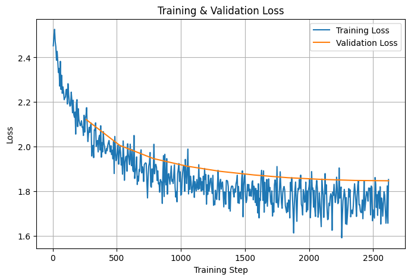
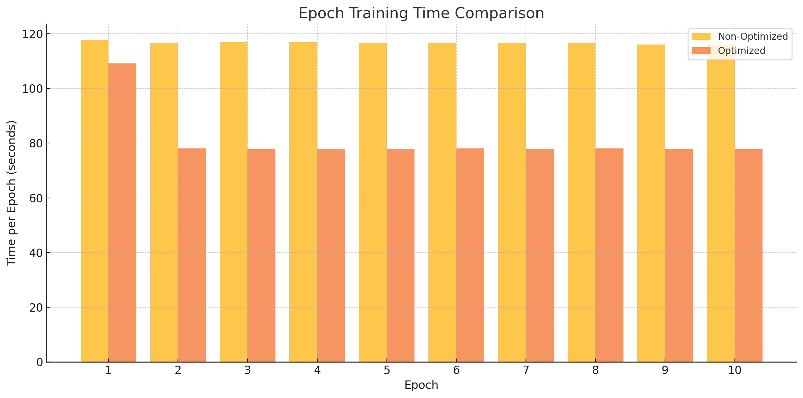

# Training and Optimizing a Self-Created GPT and Fine-Tuned LLaMA for Domain Adaptation to Finance 

## Team Information
- **Team Name**: Polar Spring
- **Members**:
  - Anvit Thekkatte apt2145
  - Shon Shtern ss7007
  - Tanmay Bankar ttb2121

---

## 1. Problem Statement
General-purpose LLMs often lack financial domain expertise and are resource-intensive to fine-tune or deploy efficiently.

This project develops and benchmarks three large language models specialized for financial tasks:

1. A **custom GPT model** built from scratch using PyTorch and trained on financial news data.
2. A **custom optimzed GPT model** that optimizes the above model.
3. A **fine-tuned Meta LLaMA 3.2-1B 4bit quantized model**, adapted for financial tasks using LoRA/qLoRA and other HPML (High-Performance Machine Learning) optimizations.

---


## 2. Model Description


## 3. Final Results Summary

Custom GPT: 

| Metric               | Value       |
|----------------------|-------------|
| Final Validation Loss| 2.25      |
| Perplexity           | 9.50      |
| Inference Latency    | XX.XX ms    |
| Model Size           | XX MB       |
| Peak Memory Use      | XX MB       |
| Training Time/Epoch  | 84.24 s     |
| Device               | A100        |


Llama 3.2 1b (4 bit quantized) finetuned: 

| Metric                    | Value       |
|---------------------------|-------------|
| Final Eval Loss           | 1.84        |
| Final Eval Perplexity     | 6.34        |
| Inference Latency         | 3860.18 ms  |
| Model Size                | 2.3 GB      |
| Peak Memory Use           | 3.557 GB    |
| Training Time/Epoch       | 242.5 s     |
| Device                    | A100        |


## 4. Reproducibility Instructions

### A. Requirements

For the finetuning of LLama Model run this in **`llama_finetune/finetuning/`**. You wont need to install the dependencies if you are running the notebooks on Google Colab.

```bash
pip install -r requirements.txt

```

It is recommended that you run this on Google Colab, as unsloth dependencies installed on local machine havent been tested. We ourselves have written the documentation to be run on Colab. 


### B. How To Use the Custom GPT Model

To both train and evaluate using the custom GPT model, just run the cells within the finance_gpt_train.ipynb. Please keep in mind that the paths within the Jupyter Notebook pertain to the path we used, so be sure to change them to fit your directory paths. The primary cells you'd need to change are:
1. The mounting if needed (we used Google Colab) (First cell)
2. sys.path.append to ensure you are within the own_gpt_optimized directory (Second cell)
3. The path for the data files (Found directly after the imports)
4. Where the model will be saved (found near the end)
5. Where to load the state if necessary (Found near the end)
To provide different prompts, just change the prompt variable in the last slide.

### C. How to Use the LLaMA model 

To train model from scratch and evaluate the model (both of them are done together since its a jupyter script):

1. **Upload the **`llama_finetune/finetuning/llama_finance_finetune.ipynb`** notebook to Colab** or run it in your local Jupyter environment with access to an A100 or compatible GPU. The colab file markdown has all the necessary instructions to run the file

2. Make sure **`finance_corpus.txt`** (cleaned financial news) is available in the dataset directory.

3. Run all cells in **`llama_finance_finetune.ipynb`** (using colab preferably unless you have access to NVIDIA GPUs locally) to:
   - Load model and tokenizer
   - Preprocess and tokenize data
   - Fine-tune using LoRA and optimizations
   - Save final adapter weights
    
    Following is the result of finetuning evaluated using training and validation loss:



4. If you are running only inference run the **`llama_finetune/finetuning/inference.ipynb`** notebook. In that notebook make sure you set the path of the adapter weights to **`llama_finetune/adapter_weights/copy_unsloth_a100_8`**. When running in colab, download this directory and then set this directory as the corresponding colab path.


## Project Components

---

### From Scratch GPT

The **`own_gpt`** folder:

This contains the code for the custom gpt model.
The files in this folder have to be uploaded to google drive and then run the jupyter notebok to train the model. 
The path has to be changed to the google drive path.

---

#### Contents
**`model.py`:** contians the code for the gpt model.
**`utils.py`:** contains the code for to generate text.
**`data_utils.py`:** contains the code for the tokeizer and loading the dataset for the model.
**`finance_gpt_train.ipynb`:** for training the model on google collab.

The data is in the data folder

---

#### How to Use

1. **Upload the **`own_gpt`** folder to Google drive** and run the **`finance_gpt_train.py`** on google colab with access to an A100 or compatible GPU. The colab file markdown has all the necessary instructions to run the file

2. Make sure **`finance_corpus.txt`** (cleaned financial news) is available in the dataset directory, and all directories are set correctly in the Jupyter Notebook.

3. Makse sure the that path is set correctly so the notbook is able to access the other files. 

3. Run all cells in **`finance_gpt_train.py`** to:
   - Load model and tokenizer
   - Preprocess and tokenize data
   - Train the model
   - Save the model
   - Give the model a prompt


---
The **`own_gpt_optimized`** folder:

This contains the code for the custom optimized gpt model.
The contents of this model are similar to thet of own_gpt.
To run this model follow the same instructions as **`own_gpt`** but use the files in the **`own_gpt_optimized`** folder.

Following is a chart that shows training time for the non optimized version vs. the optimized version



---

### LLaMA Fine-Tuning for Financial Domain Adaptation

**`llama_finetune/`** folder contains the code and output artifacts for **fine-tuning Meta's LLaMA 3.2-1B 4bit quantized** model on financial news data using **LoRA/qLoRA** and high-performance ML techniques.

The fine-tuning uses the [Unsloth](https://github.com/unslothai/unsloth) library to maximize throughput and minimize GPU memory usage.

---

#### Contents

- **`llama_finetune/adapter_weights/`**  
  Contains LoRA adapter checkpoints saved after fine-tuning. These can be loaded for inference without modifying the base model.

- **`llama_finetune/finetuning/llama_finance_finetune.ipynb`**  
  The main notebook used for fine-tuning LLaMA 3.2-1B on an A100 GPU. This notebook includes:
  - Loading the 4-bit quantized base model
  - Applying LoRA adapters (rank = 16, alpha = 16)
  - Tokenizing and packing a finance news corpus
  - Running training for multiple epochs
  - Logging throughput, loss, and memory usage

- **`llama_finetune/notebooks`**
    All the notebooks used to run experiments with different batch sizes/parameters for Lora/mized precision 

- **`llama_finetune/dataset`**
    Contains the dataset and the preprocessing files including the JSON dump

---

#### Key Fine-Tuning Optimizations

- **LoRA (Low-Rank Adaptation):**  
  Trains only a small set of adapter parameters, reducing memory and compute cost.

- **qLoRA (4-bit Quantization):**  
  Loads the base model in 4-bit NF4 format, reducing VRAM usage by 75%.

- **Mixed Precision (bf16):**  
  All non-quantized layers use bf16, improving training speed without loss of accuracy.

- **Torch.compile:**  
  Uses PyTorch 2.0's graph compiler for faster training.

- **Packing:**  
  Packs multiple short sequences into fixed-length 512-token blocks for better GPU utilization. Although currently Hugging face's packing is buggy so they have disabled it.

- **KV Cache Enabled:**  
  Speeds up inference by reusing keys and values across tokens. Unsloth uses this by default.

---

1. If you are doing only inference first install unsloth.

```python
%%capture
import os
if "COLAB_" not in "".join(os.environ.keys()):
    !pip install unsloth
else:
    # Do this only in Colab notebooks! Otherwise use pip install unsloth
    !pip install --no-deps bitsandbytes accelerate xformers==0.0.29.post3 peft trl==0.15.2 triton cut_cross_entropy unsloth_zoo
    !pip install sentencepiece protobuf datasets huggingface_hub hf_transfer
    !pip install --no-deps unsloth

```

NOTE: The **`llama_finetune/finetuning/inference.ipynb`** notebook does take care of this so shouldnt be worried about much.


2. Then use the saved LoRA weights like this:

```python
import torch
from peft import prepare_model_for_kbit_training, PeftModel
from unsloth import FastLanguageModel


base, tokenizer = FastLanguageModel.from_pretrained(
    model_name     = "unsloth/Llama-3.2-1B-bnb-4bit",  
    max_seq_length = 128,
    dtype          = None,                   
    load_in_4bit   = True,
    device_map     = "auto",
)


tokenizer.pad_token = tokenizer.eos_token
base.config.pad_token_id = tokenizer.pad_token_id
base.config.use_cache      = True


base = prepare_model_for_kbit_training(base)


#-----THIS IS WHERE YOU PUT save_path AS THE FOLDER WHERE YOU SAVED THE WEIGHTS----#
model = PeftModel.from_pretrained(
    base,
    save_path,     # folder where we saved adapters + tokenizer
    device_map="auto",          
)


FastLanguageModel.for_inference(model)


def answer(prompt: str,
           max_new_tokens: int = 128,
           temperature: float    = 0.2,
           top_p: float          = 0.7,
           repetition_penalty: float = 1.2,
           no_repeat_ngram_size: int = 3):
    
    inputs = tokenizer(
        prompt,
        return_tensors="pt",
        truncation=True,
        max_length=512
    ).to(model.device)

    input_ids = inputs["input_ids"]

    
    outputs = model.generate(
        **inputs,
        max_new_tokens       = max_new_tokens,
        temperature          = temperature,
        top_p                = top_p,
        do_sample            = True,
        repetition_penalty   = repetition_penalty,
        no_repeat_ngram_size = no_repeat_ngram_size,
        eos_token_id         = tokenizer.eos_token_id,
        pad_token_id         = tokenizer.pad_token_id,
        early_stopping       = True,
    )

    
    gen_ids = outputs[0][ input_ids.shape[-1] : ]
    return tokenizer.decode(gen_ids, skip_special_tokens=True).strip()

```


We evaluate the impact of optimization techniques like LoRA, qLoRA, Torch.compile, mixed precision training, and KV cache improvements on model efficiency, latency, and performance.

---

### Dataset

**`llama_finetune/dataset/`** is the directory for preprocessing the dataset and dumping the corpus. We have scraped a list of all the S&P500 companies sorted by their market cap, and used the EODHD API to extract financial news on each of these companies. Eventually we ended up with **9285** articles.

Running 

```bash 
python preprocess.py
```
will extract all the news (you need an API KEY)

